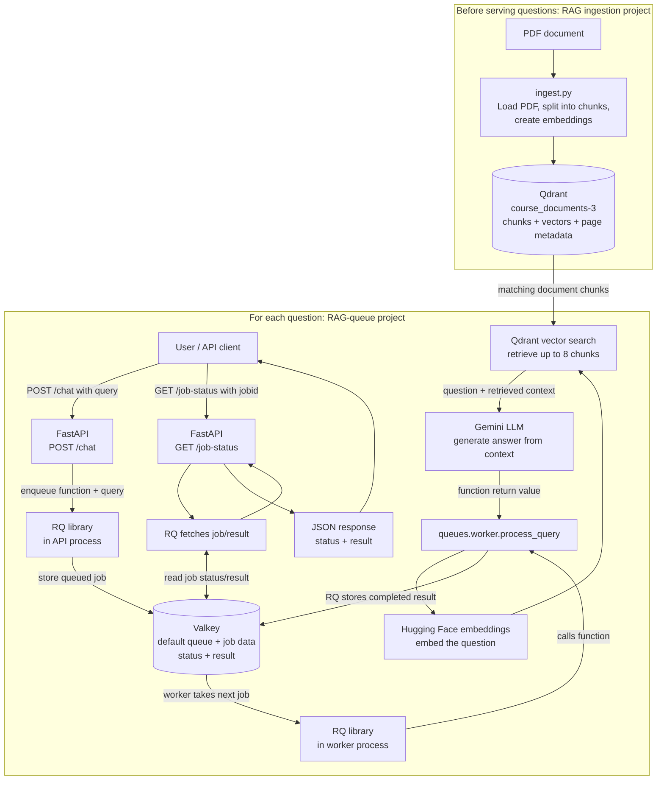

# RAG Concepts and Architecture

This document explains how the `RAG` ingestion project and this `RAG-queue`
retrieval/API project work together, what the main technologies do, and how a
question travels through the system.

## Two stages of the RAG system

The system has two distinct stages:

1. **Ingestion (`RAG` project):** reads the PDF, splits its text into chunks,
   creates an embedding for each chunk, and stores the vectors and page
   metadata in Qdrant. This is normally run when documents are added or
   refreshed, not for every question.
2. **Retrieval and answering (`RAG-queue` project):** accepts a question,
   searches the already-populated Qdrant collection for similar chunks, and
   asks Gemini to answer using the retrieved context.

The retrieval API expects the Qdrant collection `course_documents-3` to have
already been populated by ingestion.

## Concepts and technologies

| Concept / technology | Role in this project |
| --- | --- |
| **RAG (Retrieval-Augmented Generation)** | Retrieves relevant stored document text and provides it to an LLM as context for answering a question. |
| **Chunk** | A segment of a document. Ingestion splits PDF pages into chunks so retrieval can find relevant portions instead of sending the whole PDF to the LLM. |
| **Embedding** | A numeric representation of text used to compare semantic similarity. Ingestion embeds document chunks; the worker embeds the user's query using `sentence-transformers/all-MiniLM-L6-v2`. |
| **Qdrant** | Vector database that stores document embeddings, chunk text, and metadata such as page numbers. In this project it is exposed at `localhost:6333`. |
| **Vector search** | Finds chunks in Qdrant whose embeddings are similar to the query embedding. The worker requests up to eight chunks. |
| **LLM (Gemini)** | Generates a natural-language response from the user's question and retrieved context. |
| **FastAPI** | Exposes HTTP endpoints. `POST /chat` enqueues a question; `GET /job-status` lets the caller check its job and retrieve its result. |
| **RQ (Redis Queue)** | Python library used by both the API process and worker process. It serializes/enqueues jobs, runs queued functions in a worker, and reads/writes job state and results in Valkey. RQ itself is not a database or separate service. |
| **Valkey** | Redis-compatible service used by RQ to store the queue, job data, statuses, and completed results. In this setup it listens on `localhost:6379`. |
| **Worker process** | A separate running Python process started with `rq worker`. It uses RQ to take jobs from Valkey and execute `queues.worker.process_query`. |
| **Job ID** | Identifier returned by `POST /chat`. The API caller supplies it to `GET /job-status` to check progress and retrieve the answer after completion. |

## Architecture and request flow



## What happens to the result?

1. FastAPI calls RQ to enqueue the function name and query in Valkey. It returns
   the job ID to the caller immediately; the answer is not ready yet.
2. The RQ worker process reads the queued job from Valkey and calls
   `queues.worker.process_query(query)`.
3. The worker embeds the query, asks Qdrant for matching document chunks, and
   passes those chunks and the question to Gemini.
4. `process_query` returns the generated answer. RQ stores the return value and
   finished status in Valkey under the job.
5. The caller sends the job ID to `GET /job-status`. FastAPI asks RQ to fetch
   that job; RQ reads the job data from Valkey and gives it back to FastAPI.
   FastAPI then sends the status and, when finished, the answer as JSON.

**In short:** Valkey stores the job and result; RQ reads and writes that data;
FastAPI returns it to the API caller.

## Issues encountered and how this setup addresses them

### Default RQ worker on Windows

The default RQ worker attempted to use `os.fork()`, which Windows does not
provide. Starting the worker with
`--worker-class rq.worker.SimpleWorker` avoids that fork-based process model.

### Importing the queued function

RQ jobs refer to `queues.worker.process_query`. The worker must be able to
import the project package to resolve that function. Running the worker from
the `RAG-queue` folder with `--path .` adds the project folder to its import
path:

```powershell
rq worker --worker-class rq.worker.SimpleWorker --path . default
```

### Long-running query work and result retrieval

Generating an answer may take longer than an HTTP request should remain open.
`POST /chat` therefore queues the work and returns a job ID. The caller checks
`GET /job-status` with that ID until the job is finished, then reads the result.
This separates accepting a question from processing it and allows multiple
workers to process separate queued jobs.

## Architecture image

**Image placeholder:** Add your architecture image here when ready. A suitable
location would be `assets/rag-architecture.png`.
